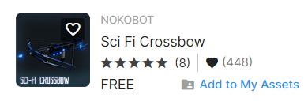
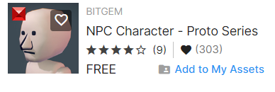

# AtividadeMusica
Atividade passada pela orientadora Aline Firmino. Um jogo de 2 fases no unity

## Requisitos
Para ver essa cena é preciso o Unity com a versão 2021.3.22f1

Instalação 1.clonar o projeto https://drive.google.com/file/d/1bPoxJ0S6E9ZOgZpR5tz6LMC4BgAriMGx/view?usp=drive_link

2.Abrir o projeto no Unity.

Desenvolvimento

Para criar esse projeto foram utilizados os seguintes passos:

1. baixar assets na assets store.

* Esses foram os assets baixados para o projeto

2. Colocar os game objects na cena.

* Para a cena foi adicionados 4 Npcs diferentes para serem alvos do jogador.

* Para facilitar na criação do jogo coloquei um template ja pronto do unity.

3.criar os scripts e programar

* Foram criador 3 scripts

* Inimigo.cs segue o codigo comentado.

using System.Collections;
using System.Collections.Generic;
using UnityEngine;
using UnityEngine.AI; // Importe o namespace corretamente.

[RequireComponent(typeof(NavMeshAgent))]
public class Inimigo : MonoBehaviour
{
    private GameObject player;
    private NavMeshAgent navMesh;

    void Start()
    {
        player = GameObject.FindWithTag("Player"); // Encontra o jogador com a tag "Player".
        navMesh = GetComponent<NavMeshAgent>(); // Obtém o componente NavMeshAgent do inimigo.
    }

    void Update()
    {
        navMesh.destination = player.transform.position; // Define a posição de destino para seguir o jogador.
    }

    // Verifica colisões com objetos chamados "Arrow".
    private void OnCollisionEnter(Collision collision)
    {
        if (collision.gameObject.CompareTag("Arrow")) // Verifica se colidiu com um objeto que tenha a tag "Arrow".
        {
            Destroy(gameObject); // Destroi o inimigo quando colide com uma "Arrow".
        }
    }
}

* Gun.cs segue o codigo comentado.

* using System.Collections;
using System.Collections.Generic;
using UnityEngine;
using StarterAssets; // Importe o namespace StarterAssets.

public class Gun : MonoBehaviour
{
    private StarterAssetsInputs _input; // Referência ao componente StarterAssetsInputs para entrada do jogador.
    [SerializeField]
    private GameObject arrowPrefab; // Prefab da flecha que será disparada.
    [SerializeField]
    private GameObject arrowPoint; // Ponto de origem do disparo da flecha.
    [SerializeField]
    private float arrowSpeed = 600; // Velocidade inicial da flecha.

    // Start é chamado antes do primeiro frame.
    void Start()
    {
        // Obtém a referência ao componente StarterAssetsInputs do objeto raiz (geralmente o jogador).
        _input = transform.root.GetComponent<StarterAssetsInputs>();
    }

    // Update é chamado uma vez por frame.
    void Update()
    {
        // Verifica se o jogador pressionou o botão de disparo.
        if (_input.shoot)
        {
            Shoot(); // Chama a função de disparo.
            _input.shoot = false; // Define o botão de disparo como falso para evitar múltiplos disparos contínuos.
        }
    }

    // Função responsável por realizar o disparo da flecha.
    void Shoot()
    {
        Debug.Log("shoot!"); // Registra no console para verificar o disparo.

        // Instancia uma flecha no ponto de origem (arrowPoint) com a rotação atual.
        GameObject arrow = Instantiate(arrowPrefab, arrowPoint.transform.position, transform.rotation);

        // Adiciona uma força à flecha na direção em que o objeto Gun está apontando.
        arrow.GetComponent<Rigidbody>().AddForce(transform.forward * arrowSpeed);

        // Destroi a flecha após 1 segundo (tempo de vida da flecha).
        Destroy(arrow, 1);
    }
}

* Sla.cs segue o codigo comentado.

* using System.Collections;
using System.Collections.Generic;
using UnityEngine;
using UnityEngine.SceneManagement; // Importa o namespace para gerenciamento de cenas do Unity.

public class Sla : MonoBehaviour
{
    public int vida = 100; // A quantidade de vida do jogador.
    public string cena; // O nome da cena para a qual você deseja fazer a transição após a morte do jogador.

    // Start é chamado antes do primeiro frame.
    void Start()
    {
        // Nada é feito aqui neste momento.
    }

    // Awake é chamado antes do Start e é frequentemente usado para inicializações.
    void Awake()
    {
        transform.tag = "Player"; // Define a tag do objeto como "Player".
    }

    // Update é chamado uma vez por frame.
    void Update()
    {
        // Verifica se a vida do jogador é menor ou igual a zero.
        if (vida <= 0)
        {
            vida = 0; // Garante que a vida não seja negativa.

            Debug.Log("Morreu"); // Registra no console a mensagem "Morreu".
            
        }
    }
}

#Cena 2 

Desenvolvimento

Para criar esse projeto foram utilizados os seguintes passos:

1. baixar assets na assets store.

* Esses foram os assets baixados para o projeto

2. Colocar os game objects na cena.

* Para a cena foi adicionados 4 Npcs diferentes para atacar o jogador do jogador.

* Para facilitar na criação do jogo coloquei um template ja pronto do unity.

3.criar os scripts e programar

* Foram criador 3 scripts

* inimigo.cs segue o codigo comentado.

* using System.Collections;
using System.Collections.Generic;
using UnityEngine;
using UnityEngine.AI; // Importe o namespace corretamente.

[RequireComponent(typeof(NavMeshAgent))]
public class Inimigo : MonoBehaviour
{
    private GameObject player;
    private NavMeshAgent navMesh;
    private bool podeAtacar;

    void Start()
    {
        podeAtacar = true;
        player = GameObject.FindWithTag("Player"); // Encontra o jogador com a tag "Player".
        navMesh = GetComponent<NavMeshAgent>(); // Obtém o componente NavMeshAgent do inimigo.
    }

    void Update()
    {
        navMesh.destination = player.transform.position; // Define a posição de destino para seguir o jogador.
        if (Vector3.Distance(transform.position, player.transform.position) < 1.5f)
        {
            Atacar(); // Chama a função Atacar quando o jogador está próximo.
        }
    }

    void Atacar()
    {
        if (podeAtacar == true)
        {
            StartCoroutine(TempoDeAtaque()); // Inicia a co-rotina para controlar o tempo entre os ataques.
            player.GetComponent<Sla>().vida -= 40; // Reduz a vida do jogador (assumindo que ele tenha um script chamado "Sla").
        }
    }

    IEnumerator TempoDeAtaque()
    {
        podeAtacar = false; // Impede que o inimigo ataque novamente imediatamente.
        yield return new WaitForSeconds(1); // Espera por 1 segundo.
        podeAtacar = true; // Permite que o inimigo ataque novamente após o tempo de espera.
    }

    // Verifica colisões com objetos chamados "Arrow".
    private void OnCollisionEnter(Collision collision)
    {
        if (collision.gameObject.CompareTag("Arrow")) // Verifica se colidiu com um objeto que tenha a tag "Arrow".
        {
            Destroy(gameObject); // Destroi o inimigo quando colide com uma "Arrow".
        }
    }
}

*sla.cs segue o codigo comentado

using System.Collections;
using System.Collections.Generic;
using UnityEngine;
using UnityEngine.SceneManagement; // Importa o namespace para gerenciamento de cenas do Unity.

public class Sla : MonoBehaviour
{
    public int vida = 100; // A quantidade de vida do jogador.
    public string cena; // O nome da cena para a qual você deseja fazer a transição após a morte do jogador.

    // Start é chamado antes do primeiro frame.
    void Start()
    {
        // Nada é feito aqui neste momento.
    }

    // Awake é chamado antes do Start e é frequentemente usado para inicializações.
    void Awake()
    {
        transform.tag = "Player"; // Define a tag do objeto como "Player".
    }

    // Update é chamado uma vez por frame.
    void Update()
    {
        // Verifica se a vida do jogador é menor ou igual a zero.
        if (vida <= 0)
        {
            vida = 0; // Garante que a vida não seja negativa.

            Debug.Log("Morreu"); // Registra no console a mensagem "Morreu".

           
        }
    }
}

